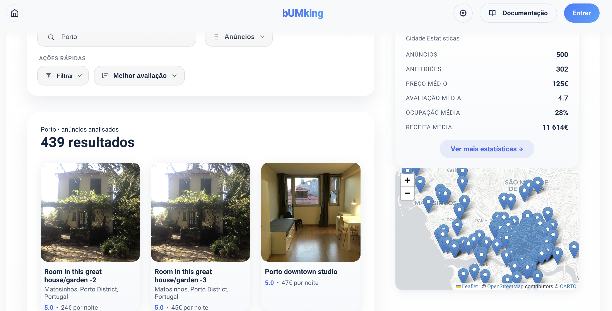
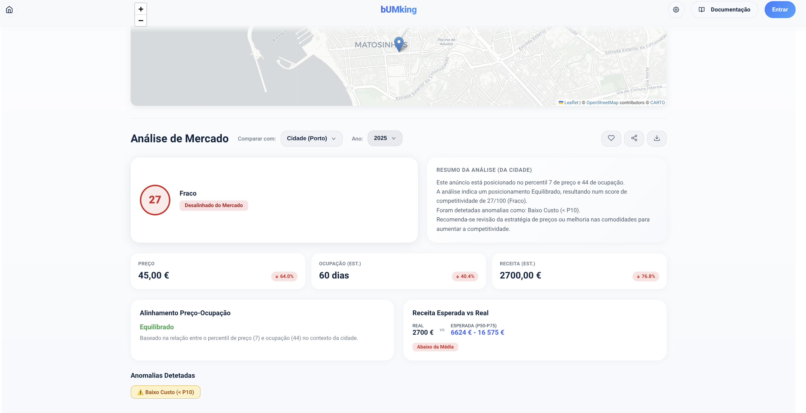
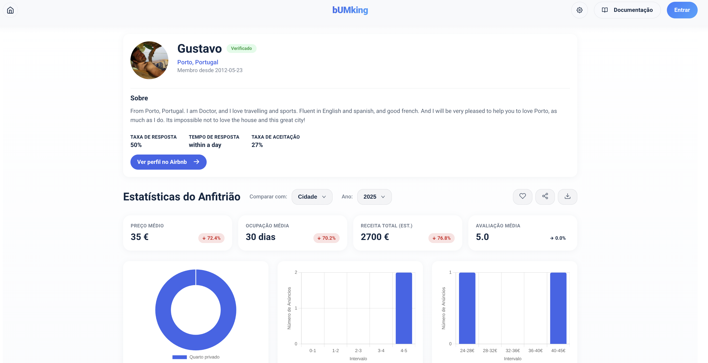

# bUMking

Market analytics and visualization system for local accommodation, developed for the IPM course. The application allows you to explore insights about hosts, listings, neighborhoods, and market trends, with an interactive interface and advanced visualizations.

<table align="center">
  <tr>
    <td align="center">
      
    </td>
    <td align="center">
      
    </td>
  </tr>
  <tr>
    <td align="center">
      
    </td>
    <td align="center">
      
    </td>
  </tr>
</table>

## Grade

**Final Grade:** 19 / 20 ⭐

## Authors

- *Simão Oliveira* -> [@SimaoOliveira05](https://github.com/SimaoOliveira05)
- *Gabriel Dantas* -> [@gabil88](https://github.com/gabil88)
- *José Fernandes* -> [@JoseLourencoFernandes](https://github.com/JoseLourencoFernandes)

## Requirements

- Node.js 18+
- npm

## Building

```bash
npm install
npm run build
```

## Running

```bash
npm run dev
```

The application will be available at `http://localhost:5173`.

## Test Mode

```bash
npm run test
```
